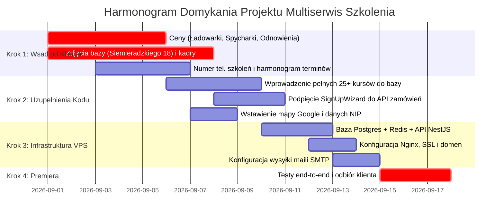

# Raport Postępu Prac i Kompletna Lista Braków Projektu Multiserwis Szkolenia

**Data sporządzenia raportu:** Sierpień 2026  
**Projekt:** Multiserwis Szkolenia – Platforma E-Learning (LMS), Portal Kursów Zawodowych i Wynajmu Sprzętu  
**Lokalizacja repozytorium:** `d:\Projekty\_KLIENCI\Multiserwis\multiserwis-szkolenia`  
**Autor:** Antigravity AI (Główny Architekt & Pair Programmer)

---

## 1. Wstęp i Podsumowanie Historii Projektu

Projekt **Multiserwis Szkolenia** powstał w celu stworzenia nowoczesnego, kompleksowego portalu edukacyjno-sprzedażowego dla firmy **Multiserwis z Kutna**. Portal łączy marketingową prezentację oferty szkoleniowej z zaawansowaną platformą e-learningową (LMS), systemem zarządzania uprawnieniami B2B dla firm, zautomatyzowanym egzaminowaniem oraz modułem wynajmu maszyn ciężkich.

Projekt jest powiązany z drugą stroną klienta – **Multiserwis Usługi** (`multiserwis-uslugi`), tworząc spójny ekosystem: usługi techniczne, dźwigowe, spawalnicze i relokacje maszyn na jednej domenie oraz certyfikowane szkolenia zawodowe (UDT, IMBiGS, SEP, Spawalnictwo) na dedykowanej platformie szkoleniowej.

---

## 2. Ewolucja Architektury i Aktualny Stack Technologiczny

W toku prac repozytorium przeszło ewolucję z początkowej wersji SPA opartej o mocki do pełnoprawnego **monorepo npm**:

1. **Frontend Aplikacji (Root Workspace):**
   - **Framework & Build:** Vite 6 + React 19 + TypeScript + Tailwind CSS 3.
   - **E-Learning & Video:** Odtwarzacz HLS (`hls.js`) ze streamingiem adaptacyjnym, zabezpieczeniem znakiem wodnym i trybem skupienia ("Study Mode").
   - **Edytor treści:** TipTap (`@tiptap/react`) do tworzenia i edycji treści lekcji.
   - **Zarządzanie stanem:** Zustand (`authStore`, `cartStore`).
   - **Formularze i Walidacja:** Zod, Sonner (system powiadomień Toast).
   - **Wielojęzyczność (i18n):** `i18next` z obsługą języków: **Polski (PL)**, **Angielski (EN)**, **Ukraiński (UA)**.
   - **Testy automatyczne:** Playwright (konfiguracja E2E w `playwright.config.ts`).
   - **Deploy podglądowy:** GitHub Pages (`docs/`, base path `/multiserwis-kutno/`).

2. **Backend API (`apps/api`):**
   - **Framework:** NestJS (Node.js / TypeScript).
   - **Baza danych & ORM:** PostgreSQL + Prisma 7 (z nowoczesnym driverem Pg adapter).
   - **Pamięć podręczna:** Redis (zarządzanie sesjami i cache).
   - **Uwierzytelnianie:** JWT + Bcrypt + role (`ADMIN`, `MANAGER`, `STUDENT`, `COMPANY_GUARDIAN`).

3. **Pakiet Portalowy / Informacyjny (`apps/site`):**
   - Generator stron statycznych **Astro 5** dedykowany pod SEO i content marketing.

4. **Współdzielone biblioteki (`packages/shared`):**
   - Modele danych TypeScript, schematy walidacji i reguły biznesowe współdzielone pomiędzy frontendem i API.

---

## 3. Co zostało już ZREALIZOWANE (Stan Faktyczny)

### 3.1. Część Publiczna i Marketingowa
- [x] **Strona Główna (`HomeView`):** Dynamiczny Hero z tagline'em *"Profesjonalne Szkolenia"*, liczniki zaufania (5000+ przeszkolonych osób, 98% zdawalności), kafelki najpopularniejszych kursów, sekcja "Dlaczego Multiserwis", opinie kursantów, bezpośrednie boksy odsyłające do usług serwisowych i wynajmu.
- [x] **Katalog Szkoleń (`CatalogView`):** Wyszukiwarka na żywo, filtracja po kategoriach (UDT, IMBiGS, SEP, Spawalnictwo, Inne), przełączanie widoków (kafelki / lista), wyróżnienia kursów popularnych i promocyjnych.
- [x] **Dedykowane Podstrony Kategorii (Landing Pages):**
  - Szkolenia UDT (`UDTSection`) – wózki widłowe, ładowarki teleskopowe, wózki z podnoszonym operatorem, żurawie HDS i samojezdne, suwnice, podesty ruchome (zwyżki), wciągarki, odnowienia uprawnień.
  - Maszyny Budowlane IMBiGS (`IMBIGSSection`) – koparko-ładowarki, koparki jednonaczyniowe, ładowarki, walce drogowe, spycharki, równiarki, frezarki, rozściełacze asfaltu, pompy do betonu.
  - Uprawnienia SEP (`SEPSection`) – G1 (elektryczne), G2 (cieplne/energetyczne), G3 (gazowe), pomiary ochronne.
  - Spawalnictwo (`WeldingSection`) – MIG/MAG, TIG, MMA (elektryczne), gazowe, weryfikacja certyfikatów spawalniczych.
  - Pozostałe specjalistyczne (`OtherSection`) – kontrola zawiesi, pilarki mechaniczne, kosy spalinowe, windy załadowcze, hakowy-sygnalista, kierowanie ruchem.
- [x] **Karta Szczegółów Szkolenia (`CourseDetailView`):** Szczegółowy program modułów (`JOB_PROGRAMS`), wymagania wstępne, certyfikacja, rozbicie na wariant Teoria Online vs Szkolenie Stacjonarne, opcja dodania do koszyka i natychmiastowego zapisu.
- [x] **Harmonogram Szkoleń (`ScheduleView` / `Schedule`):** Kalendarz nadchodzących zjazdów i egzaminów z filtrowaniem po kategoriach i informacją o wolnych miejscach.
- [x] **Kreator Zapisu na Szkolenie (`SignUpWizard` / `WizardView`):** 5-etapowy proces doboru kursu, terminu i podania danych osobowych lub firmowych.
- [x] **Katalog Wynajmu Maszyn (`RentalsView` & `MachineDetailView`):** Prezentacja parku maszynowego (ładowarki teleskopowe, podnośniki koszowe, koparko-ładowarki) ze specyfikacją techniczną (wysokość robocza, udźwig, masa).
- [x] **O Nas (`AboutView`):** Prezentacja doświadczenia firmy, akredytacji ISO/UDT, sylwetki instruktorów (`StaffGrid`) oraz infrastruktury (`BaseGallery`).
- [x] **Kontakt (`ContactView`):** Formularz zapytania, dane adresowe ośrodka w Kutnie (ul. Siemieradzkiego 18), godziny pracy, infolinia.
- [x] **Koszyk i Checkout B2B/B2C (`CartView`):** Wybór ilości licencji, dane do faktury VAT, podsumowanie kwot netto/brutto.
- [x] **Podstrony Prawne:** Regulamin świadczenia usług szkoleniowych (`TermsView`) oraz Polityka Prywatności RODO (`PrivacyView`).

### 3.2. Platforma E-Learningowa i 4 Dedykowane Panele Użytkowników
- [x] **Panel Kursanta (LMS – `StudentPanel` / `LMSView`):**
  - Pulpit kursanta z aktywnymi kursami, paskami postępu i historią lekcji.
  - **Odtwarzacz Lekcji (`LessonPlayerView`):** Odtwarzanie wideo HLS, automatyczne oznaczanie postępów, nawigacja po spisie treści modułów, pobieranie materiałów PDF, edytor notatek.
  - **Centrum Testów i Egzaminów (`LessonQuiz` / `StudentExamsPage`):** Baza pytań testowych (jednokrotny/wielokrotny wybór), pytania otwarte z wyjaśnieniem instruktorskim, symulacja egzaminu państwowego UDT/IMBiGS z limitem czasowym.
  - **Weryfikator i Generator Certyfikatów (`StudentCertificationsPage`):** Cyfrowy certyfikat ukończenia z unikalnym numerem weryfikacyjnym, kodem QR i funkcją drukowania.
  - **Planer i Cele Nauki (`StudentGoalsPage`):** Tygodniowe cele, passy nauki, statystyki czasu spędzonego na platformie.
- [x] **Panel Opiekuna Firmy (B2B – `GuardianPanel`):**
  - Pulpit zbiorczy pracodawcy: liczba wykupionych licencji, aktywni pracownicy, wskaźnik ukończenia szkoleń.
  - Zarządzanie kadrą: dodawanie pojedynczych pracowników, import masowy, przypisywanie kursów, wysyłka zaproszeń e-mail.
  - Raporty i zestawienia postępów pracowników do celów BHP i audytów.
- [x] **Panel Managera Szkoleń (`ManagerPanel`):**
  - Harmonogram grup szkoleniowych i zajęć praktycznych na placu manewrowym.
  - Nadzór nad frekwencją, wynikami testów cząstkowych i dopuszczeniem do egzaminu UDT.
  - Wgląd w bazę kursantów i firm zamawiających.
- [x] **Panel Administratora (`AdminView` / `AdminPanel`):**
  - Globalne statystyki przychodów, zamówień i liczby użytkowników.
  - **Zarządzanie Kursami (`CourseEditPage` / `AdminCourses`):** Dodawanie i edycja kursów, poziomów trudności, cen, struktury modułów i lekcji.
  - **Edytor Bazy Pytań Egzaminacyjnych (`CourseQuestionsEditor`):** Tworzenie pytań testowych, wariantów odpowiedzi, przypisywanie do modułów.
  - **Zarządzanie Użytkownikami i Firmami (`AdminUsers`, `AdminCompanies`):** Pełny CRUD kont, nadawanie ról, blokowanie, wgląd w historię zamówień.
  - **Centrum Finansów i Zamówień (`FinanceCenter`):** Zmiana statusów płatności (DRAFT, PENDING, PAID), generowanie faktur.
  - **Centrum Zgłoszeń i Wsparcia (`SupportView` / `Tickets`):** Obsługa ticketów technicznych i merytorycznych.
  - **Centrum Zaawansowanych Raportów (`ReportsCenter`):** Eksport danych, wykresy rentowności, analityka zdawalności.

---

## 4. Szczegółowa Lista Braków – Co Należy Uzupełnić, Aby Dokończyć Projekt

Listę braków podzielono na 4 logiczne kategorie:

```
┌─────────────────────────────────────────────────────────────────────────────┐
│                       STRUKTURA BRAKÓW DO UKOŃCZENIA                        │
├──────────────────────────────────────────────────�### GRUPA 1: Materiały, Dane i Decyzje od Klienta (Stan po Uzupełnieniach)

1. ✅ **Brakujące ceny i potwierdzenie cennika – ZREALIZOWANE W 100%:**
   - **Wózki widłowe UDT:** 1000 zł (zwolnione z VAT), uprawnienia na 10 lat, egzamin do 30 dni roboczych.
   - **Ładowarki teleskopowe i wózki z podnoszoną kabiną:** 1500 zł (połączona kategoria UDT z wysięgnikiem i podnoszeniem operatora), uprawnienia na 5 lat.
   - **Żurawie:** HDS przewoźne 1130 zł (10 lat), stacjonarne 1080 zł (10 lat), samojezdne i wieżowe 2480 zł (5 lat).
   - **Suwnice:** 1130 zł (ogólnego, 10 lat) / 1380 zł (specjalnego, 5 lat).
   - **Podesty ruchome (zwyżki):** 1130 zł (5 lat).
   - **Wciągarki i wciągniki:** 930 zł.
   - **Przedłużenie UDT:** 0 zł – bezpłatna pomoc doradcza przy wniosku. W razie wygaśnięcia: pełny kurs i egzamin.
   - **Maszyny budowlane (ŚBŁ-WIT / IMBiGS):** Koparkoładowarki 2350 zł, Koparki 2350 zł, Ładowarki 2350 zł, Walce 2500 zł, Spycharki kl. III 2500 zł (potwierdzone!), Równiarki 2500 zł, Frezarki 2500 zł, Rozkładarki mas bitumicznych 2600 zł, Pompy do betonu 2600 zł.
   - **Uprawnienia SEP (G1, G2, G3):** 860 zł Eksploatacja / 860 zł Dozór (zwolnione z VAT), 1 dzień szkolenia, ważne 5 lat.
   - **Szkolenia spawalnicze (PN-EN ISO 9606-1, Certyfikat SGS):** 3 moduły, 32h zajęć. Cennik live: Stal czarna od 2400 zł/moduł, Nierdzewna 2700 zł/moduł, Aluminium 2900 zł/moduł, Odnowienie uprawnień 600 zł, Cięcie gazowe/plazmowe 900 zł.
   - **Szkolenia specjalistyczne:** Zawiesia 600 zł, Pilarki 550 zł, Kosy spalinowe 600 zł, Windy samochodowe 500 zł, Hakowce/bramowce 550 zł.
   - **Badania lekarskie:** ok. 60 zł (skierowanie wydawane przy zapisie).
   - **Zasady ratalności:** 500 zł zaliczki przy zapisie, reszta na 3 dni przed egzaminem.

2. ✅ **Dedykowany numer telefonu, adres e-mail i godziny pracy – ZREALIZOWANE:**
   - **E-mail:** `multiserwis.kutno@gmail.com`
   - **Szkolenia UDT / IMBiGS / SEP:** 📞 `+48 730 101 000` oraz `+48 570 403 806`
   - **Usługi Dźwigowe / Wynajem maszyn:** 📞 `+48 730 202 000` oraz `+48 733 929 100`
   - **Biuro:** ul. Siemieradzkiego 18, 99-300 Kutno (Pn–Pt 8:00–16:00)
   - **Baza i plac manewrowy:** ul. Przemysłowa 2, 99-300 Kutno (z bezpłatnym parkingiem dla kursantów).

3. ✅ **Oficjalne dane rejestrowe firmy (NIP / REGON) – ZREALIZOWANE W 100%:**
   - **MULTI-SERWIS Kamil Kapruziak** (Ośrodek Szkoleniowy, ul. Henryka Siemiradzkiego 18, 99-300 Kutno): **NIP: 7752404382**, **REGON: 100587019** (działalność od 2008 r.).
   - **MULTISERWIS KUTNO SP. Z O.O.** (Plac i sprzęt ciężki, ul. Przemysłowa 2, 99-300 Kutno): **NIP: 7752676330**, **REGON: 541108550**, **KRS: 0001160280**.
   - Wdrożono do stopek, polityki prywatności oraz regulaminu.

4. ✅ **Zasady harmonogramu i terminów – ZREALIZOWANE:**
   - Harmonogram zajęć praktycznych i jazd ustalany jest na bieżąco w każdy piątek na nadchodzący tydzień. Egzaminy UDT do 30 dni roboczych, ŚBŁ-WIT do 45 dni. Teoria online w LMS dostępna od zaraz po zapisie.

4. 🟡 **Prawdziwe zdjęcia bazy szkoleniowej (ul. Przemysłowa 2 / Siemieradzkiego 18):**
   - **Status:** Oczekuje na dosłanie zdjęć przez klienta (sala wykładowa, hala warsztatowa, plac manewrowy). Tymczasowo wdrożone estetyczne wizualizacje techniczne.

5. 🟡 **Zdjęcia i opisy kadry instruktorskiej:**
   - **Status:** Materiały są w posiadaniu dewelopera, przygotowane do wdrożenia w dedykowanym kroku.

6. 🟡 **Materiały wideo do platformy e-learningowej (LMS):**
   - **Status:** Deweloper w trakcie przygotowywania nagrań lekcji i wykładów wideo.

---

### GRUPA 2: Zadania Programistyczne i Uzupełnienia w Kodzie (Frontend & Backend)

1. ✅ **Aktualizacja cen i bazy kursów w kodzie:**
   - Zaktualizowano cenniki UDT, ŚBŁ-WIT, SEP, Spawalnictwa i Innych w `UDTSection.tsx`, `IMBIGSSection.tsx`, `SEPSection.tsx`, `WeldingSection.tsx`, `OtherSection.tsx` oraz `constants.ts`.
   - Zaktualizowano dane kontaktowe, infolinie, bazę na ul. Przemysłowej 2 w `ContactView.tsx`, `Layout.tsx` i `Schedule.tsx`.

2. 🟡 **Podpięcie kreatora `SignUpWizard.tsx` pod API:**
   - Połączenie rejestracji z endpointem zamówień i zaliczek 500 zł.

3. 🟡 **Interaktywna mapa dojazdu w kontakcie (`ContactView.tsx`):**
   - Wdrożono interaktywny iframe Google Maps.

---

### GRUPA 3: Infrastruktura i Wdrożenie Produkcyjne (Staging vs VPS Klienta)

1. 🟡 **Środowisko Stagingowe:**
   - Serwer współdzielony (SeoHost / Apache / Node.js) dla wersji podglądowej i testów klienta.

2. 🔴 **Środowisko Produkcyjne (Docelowy VPS Klienta):**
   - Konfiguracja PostgreSQL 16+, Redis, Docker/PM2 dla API NestJS.
   - Domena produkcyjna, Nginx Reverse Proxy, certyfikat SSL Let's Encrypt.
   - Konfiguracja poczty SMTP do automatycznych potwierdzeń.
   - Uruchomienie aplikacji NestJS w środowisku produkcyjnym (np. przez PM2 lub Docker Compose).
   - Skonfigurowanie zmiennych środowiskowych w `apps/api/.env` (`DATABASE_URL`, `JWT_SECRET`, `REDIS_URL`, `CORS_ORIGIN`).

3. 🔴 **Konfiguracja Serwera WWW (Nginx) i Certyfikatów SSL:**
   - Konfiguracja Nginx jako Reverse Proxy:
     - Frontend aplikacji: `https://szkolenia.multiserwis.kutno.pl` (lub dedykowana domena).
     - Backend API: `https://api-szkolenia.multiserwis.kutno.pl`.
   - Wygenerowanie darmowych certyfikatów SSL Let's Encrypt przez Certbot.

4. 🔴 **Konfiguracja wysyłki wiadomości e-mail (SMTP):**
   - Skonfigurowanie konta pocztowego SMTP do wysyłki automatycznych e-maili:
     - Potwierdzenie rejestracji kursanta i aktywacja konta,
     - Potwierdzenie zamówienia kursu i wysyłka danych do płatności / proformy,
     - Zaproszenia dla pracowników wysyłane przez Opiekuna Firmy,
     - Resetowanie hasła,
     - Powiadomienia o zbliżającym się egzaminie UDT.

---

### GRUPA 4: Multimedia E-Learningowe i Synergia z Projektem Usług

1. 🟡 **Konfiguracja hostingu wideo (Bunny Stream / Bunny CDN):**
   - Utworzenie biblioteki wideo w Bunny Stream dla kursów e-learningowych,
   - Skonfigurowanie bezpiecznych adresów URL do strumieniowania HLS z podpisem cyfrowym (Token Authentication), zabezpieczających materiały przed nieautoryzowanym pobieraniem.

2. 🟢 **Spójność linkowania między domeną Usług a domeną Szkoleń:**
   - Wzajemne odsyłacze w menu, sekcjach promocyjnych i stopkach:
     - Na stronie Usług (`multiserwis-uslugi`): banery *"Potrzebujesz uprawnień UDT dla operatorów? Przejdź do oferty szkoleń"*.
     - Na platformie Szkoleń (`multiserwis-szkolenia`): banery *"Wynajmij maszynę do pracy lub zleć serwis UDT w Multiserwis Usługi"*.

---

## 5. Podsumowanie Wymagań i Priorytetyzacja Działań



---

## 6. Gotowa Wiadomość / Lista Pytań do Wysłania do Klienta

Poniżej przygotowano gotowy szkic krótkiej wiadomości do klienta w celu zebrania wszystkich brakujących materiałów:

```text
Dzień dobry,

Mamy już w pełni przygotowany i działający system strony oraz platformy szkoleniowej Multiserwis (katalog szkoleń, strefa kursanta z egzaminami i wideo, panel dla firm do zarządzania pracownikami oraz panel instruktora i administratora).

Abyśmy mogli w 100% zamknąć projekt i uruchomić go na docelowej domenie, potrzebujemy od Państwa kilku ostatnich materiałów i decyzji:

1. Zdjęcia:
   - Kilka zdjęć Państwa bazy szkoleniowej w Kutnie przy ul. Siemieradzkiego 18 (sala wykładowa, hala warsztatowa, plac manewrowy).
   - Zdjęcia instruktorów prowadzących zajęcia (wraz z imionami i specjalizacjami) do sekcji "Nasza Kadra".

2. Cennik i terminy:
   - Jaka jest docelowa cena szkolenia na Ładowarki Teleskopowe UDT?
   - Jaka jest cena szkolenia na Spycharki kl. III oraz kierowanie ruchem?
   - Najbliższe terminy zjazdów na najbliższy kwartał (do kalendarza szkoleń).

3. Kontakt i dane firmy:
   - Jaki numer telefonu i adres e-mail mamy wpisać jako główny kontakt do działu szkoleń?
   - Pełne dane rejestrowe firmy (NIP, pełna nazwa) do wpisania w regulaminie i stopce.

4. Wideo / Materiały:
   - Czy posiadają Państwo gotowe nagrania wykładów wideo do e-learningu, czy na start uruchamiamy platformę z materiałami tekstowymi, prezentacjami i testami egzaminacyjnymi?

Po otrzymaniu powyższych informacji natychmiast uzupełniamy serwis i przeprowadzamy wdrożenie produkcyjne.
```
